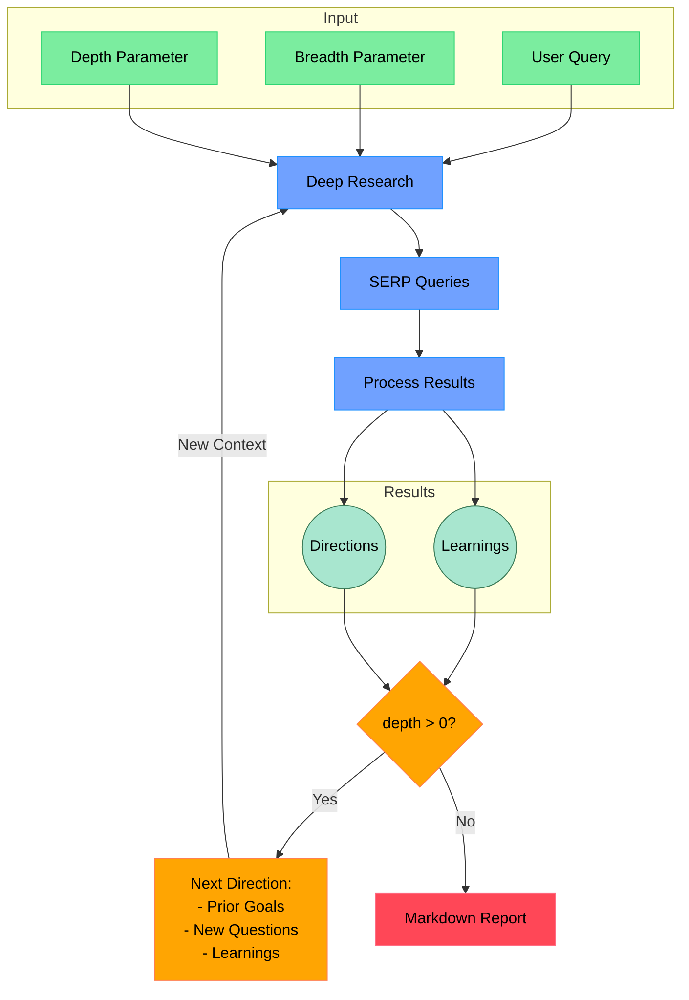

# Deep Researcher

[](https://nodejs.org/)
[](https://www.typescriptlang.org/)
[](https://makersuite.google.com/app/apikey)
[](https://github.com/modelcontextprotocol)
[](https://opensource.org/licenses/MIT)

**Your AI-Powered Research Assistant.** Conduct iterative, deep research using Google Gemini 2.5 Flash with Google Search Grounding and URL context. No web-scraping dependency is required.

---

## Table of Contents

* [Features](#features)
* [Why This Project](#why-this-project)
* [Workflow Diagram](#workflow-diagram)
* [Persona Agents](#persona-agents)
* [How It Works](#how-it-works)
* [Project Structure](#project-structure)
* [Requirements](#requirements)
* [Setup](#setup)
* [Usage](#usage)
  * [As MCP Tool](#as-mcp-tool)
  * [Standalone CLI Usage](#standalone-cli-usage)
  * [MCP Inspector Testing](#mcp-inspector-testing)
* [Configuration](#configuration)
* [Quickstart](#quickstart)
* [Example Output](#example-output)
* [Support](#support)
* [Contributing](#contributing)
* [Roadmap](#roadmap)
* [License](#license)

The goal of this project is to provide the *simplest* yet *most effective* implementation of a deep research agent.  It's designed to be easily understood, modified, and extended, aiming for a codebase under 500 lines of code (LoC).

**Key Features:**

* **MCP Integration:** Runs as a Model Context Protocol (MCP) server/tool for seamless agent integration.
* **Gemini 2.5 Flash Pipeline:** Long-context reasoning, structured JSON outputs, and tool use (Google Search Grounding, Code Execution, Functions) via env flags.
* **Iterative Deep Dive:** Query refinement + result analysis with learned context carried forward.
* **Depth & Breadth Control:** Tune exploration scope precisely.
* **Semantic/Recursive Splitting:** Token-aware chunking for robust summarization and analysis.
* **Batching + Caching:** Concurrency-limited batched model calls with LRU caches across prompts/results.
* **Professional Reports:** Generates structured Markdown (Abstract, ToC, Intro, Body, Methodology, Limitations, Key Learnings, References).

## Why This Project

* **Gemini-first, modern pipeline:** Built around Gemini 2.5 Flash with optional tools (Search Grounding, Code Execution, Functions).
* **Minimal, understandable core:** Plain TypeScript; easy to audit and extend.
* **Deterministic outputs:** Zod-validated JSON and consistent report scaffolding.
* **Agent-ready:** Clean MCP server entry; works with Inspector and MCP-aware clients.

## Workflow Diagram



## Persona Agents

**What are Persona Agents?**

In `deep-research`, we utilize the concept of "persona agents" to guide the behavior of the Gemini language models.  Instead of simply prompting the LLM with a task, we imbue it with a specific **role, skills, personality, communication style, and values.** This approach helps to:

* **Focus the LLM's Output:** By defining a clear persona, we encourage the LLM to generate responses that are aligned with the desired expertise and perspective.
* **Improve Consistency:** Personas help maintain a consistent tone and style throughout the research process.
* **Enhance Task-Specific Performance:**  Tailoring the persona to the specific task (e.g., query generation, learning extraction, feedback) optimizes the LLM's output for that stage of the research.

**Examples of Personas in use:**

* **Expert Research Strategist & Query Generator:**  Used for generating search queries, this persona emphasizes strategic thinking, comprehensive coverage, and precision in query formulation.
* **Expert Research Assistant & Insight Extractor:**  When processing web page content, this persona focuses on meticulous analysis, factual accuracy, and extracting key learnings relevant to the research query.
* **Expert Research Query Refiner & Strategic Advisor:**  For generating follow-up questions, this persona embodies strategic thinking, user intent understanding, and the ability to guide users towards clearer and more effective research questions.
* **Professional Doctorate Level Researcher (System Prompt):**  This overarching persona, applied to the main system prompt, sets the tone for the entire research process, emphasizing expert-level analysis, logical structure, and in-depth investigation.

By leveraging persona agents, `deep-research` aims to achieve more targeted, consistent, and high-quality research outcomes from the Gemini language models.

## How It Works

Core modules:

* `src/deep-research.ts` — orchestrates queries, batching, analysis, and synthesis
  * `generateSerpQueries()` uses Gemini to propose SERP-style queries from your prompt and prior learnings
  * `processSerpResult()` splits content, batches Gemini calls with tools enabled, extracts learnings and citations
  * `conductResearch()` runs analysis passes over semantic chunks
  * `writeFinalReport()` builds the final professional Markdown report
* `src/ai/providers.ts` — GoogleGenAI wrapper for Gemini 2.5 Flash, batching, token control, optional tools
* `src/ai/text-splitter.ts` — RecursiveCharacter and Semantic splitters
* `src/mcp-server.ts` — MCP server entry point and types
* `src/run.ts` — CLI entry point

Pipeline highlights:

* Structured JSON outputs validated with Zod
* Concurrency-limited batching (`generateBatch`, `generateBatchWithTools`)
* LRU caches for prompts, SERP proposals, and reports
* Optional Gemini tools via flags: Google Search Grounding, Code Execution, Functions

## Project Structure

```text
deep-research/
├─ src/
│  ├─ ai/
│  │  ├─ providers.ts           # Gemini wrapper, tools, batching, caching
│  │  └─ text-splitter.ts       # Semantic/recursive splitters
│  ├─ mcp-server.ts             # MCP server entry/types
│  ├─ deep-research.ts          # Orchestrator: queries → analysis → synthesis
│  ├─ prompt.ts                 # System + templates
│  ├─ feedback.ts               # Refinement/feedback loop
│  ├─ output-manager.ts         # Report/output formatting
│  ├─ progress-manager.ts       # CLI progress
│  ├─ terminal-utils.ts         # CLI helpers
│  ├─ types.ts                  # Zod schemas/types
│  └─ utils/                    # JSON/sanitize helpers
├─ backend/
│  └─ server.ts                 # Backend server entry point
├─ frontend/
│  ├─ index.html                # Frontend UI
│  └─ script.js                 # Frontend logic
├─ dist/                        # Build output
├─ .env.example                 # Environment template
├─ package.json                 # Scripts/deps
└─ README.md
```

## Requirements

* [Node.js](https://nodejs.org/) v22.x
* [Google Gemini API key](https://makersuite.google.com/app/apikey)

## Setup

### Node.js

1. **Clone the repository:**

    ```bash
    git clone https://github.com/shreyashkashyapanand01/collegeMajorProject1.git
    ```

2. **Install dependencies:**

    ```bash
    npm install
    ```

3. **Set up environment variables:** Create a `.env.local` file in the project root:

    ```bash
    # Required
    GEMINI_API_KEY="your_gemini_key"

    # Recommended defaults
    GEMINI_MODEL=gemini-2.5-flash
    GEMINI_MAX_OUTPUT_TOKENS=65536
    CONCURRENCY_LIMIT=5

    # Gemini tools (enable as needed)
    ENABLE_GEMINI_GOOGLE_SEARCH=true
    ENABLE_GEMINI_CODE_EXECUTION=false
    ENABLE_GEMINI_FUNCTIONS=false
    ```

4. **Build the project:**

    ```bash
    npm run build
    ```

## Usage

### As MCP Tool

To run `deep-research` as an MCP tool, start the MCP server:

```bash
node --env-file .env.local dist/mcp-server.js
```

You can then invoke the `deep-research` tool from any MCP-compatible agent using the following parameters:

* `query` (string, required): The research query.
* `depth` (number, optional, 1-5): Research depth (default: moderate).
* `breadth` (number, optional, 1-5): Research breadth (default: moderate).
* `existingLearnings` (string[], optional):  Pre-existing research findings to guide research.

**Example MCP Tool Arguments (JSON shape):**

```json
{
  "name": "deep-research",
  "arguments": {
    "query": "State of multi-agent research agents in 2025",
    "depth": 3,
    "breadth": 3,
    "existingLearnings": [
      "Tool use improves grounding",
      "Batching reduces latency"
    ]
  }
}
```

```typescript
const mcp = new ModelContextProtocolClient(); // Assuming MCP client is initialized

async function invokeDeepResearchTool() {
  try {
    const result = await mcp.invoke("deep-research", {
      query: "Explain the principles of blockchain technology",
      depth: 2,
      breadth: 4
    });

    if (result.isError) {
      console.error("MCP Tool Error:", result.content[0].text);
    } else {
      console.log("Research Report:\n", result.content[0].text);
      console.log("Sources:\n", result.metadata.sources);
    }
  } catch (error) {
    console.error("MCP Invoke Error:", error);
  }
}

invokeDeepResearchTool();
```

### Standalone CLI Usage

To run `deep-research` directly from the command line:

```bash
npm run start "your research query"
```
```bash
npx tsx backend/server.ts
```

**Example:**

```bash
npm run start "what are latest developments in ai research agents"
```
```bash
npx tsx backend/server.ts
```

### MCP Inspector Testing

For interactive testing and debugging of the MCP server, use the MCP Inspector:

```bash
npx @modelcontextprotocol/inspector node --env-file .env.local dist/mcp-server.js
```

### MCP Integration Tips

* **Environment**: Provide `GEMINI_API_KEY` to the MCP server process; model and tool flags via env.
* **Stateless calls**: The server derives behavior from env; keep flags in sync with your client profile.
* **Latency**: Enable batching and reasonable `CONCURRENCY_LIMIT` to balance speed vs rate limits.

## Configuration

* `GEMINI_API_KEY` — required
* `GEMINI_MODEL` — defaults to `gemini-2.5-flash`
* `GEMINI_MAX_OUTPUT_TOKENS` — defaults to `65536`
* `CONCURRENCY_LIMIT` — defaults to `5`
* `ENABLE_GEMINI_GOOGLE_SEARCH` — enable Google Search Grounding tool
* `ENABLE_GEMINI_CODE_EXECUTION` — enable code execution tool
* `ENABLE_GEMINI_FUNCTIONS` — enable function calling

Optional providers (planned/behind flags): Exa/Tavily can be integrated later; Firecrawl is not required for the current pipeline.

## Quickstart

1) Clone and install

```bash
git clone https://github.com/shreyashkashyapanand01/collegeMajorProject1.git
cd collegeMajorProject1
npm i && npm run build
```

2) Create `.env.local` (see [Setup](#setup))

3) Run as MCP server (Inspector)

```bash
npx @modelcontextprotocol/inspector node --env-file .env.local dist/mcp-server.js
```

4) Or run as CLI

```bash
npm run start "state of multi-agent research agents in 2025"
```
```bash
npx tsx backend/server.ts
```

## Example Output

```markdown
# Abstract
Concise overview of the research goal, scope, method, and key findings.

# Table of Contents
...

# Introduction
Context and framing.

# Body
Evidence-backed sections with citations.

# Methodology
How sources were found and analyzed.

# Limitations
Assumptions and risks.

# Key Learnings
Bulleted insights and takeaways.

# References
Normalized citations to visited URLs.
```

## Support

* **Issues:** Use GitHub Issues for bugs and feature requests.
* **Discussions:** Propose ideas or ask questions.
* **Security:** Do not file public issues for sensitive disclosures; contact maintainers privately.

## Contributing

* **PRs welcome:** Please open an issue first for significant changes.
* **Standards:** TypeScript 5.x, Node.js 22.x, lint/type-check before PRs.
* **Checks:** `npm run build` and `tsc --noEmit` must pass.
* **Docs:** Update `README.md` and `.env.example` when changing env/config.

## Roadmap

* **Exa search integration** (behind `ENABLE_EXA_PRIMARY`), Google grounding for augmentation.
* **Provider cleanup:** Remove Firecrawl after Exa migration (explicit approval required).
* **CI/CD:** Add GitHub Actions for build/lint/test and badge.
* **Examples:** Add sample reports and prompts.

## Troubleshooting

* **Missing API key**: Ensure `GEMINI_API_KEY` is set in `.env.local` and processes are started with `--env-file .env.local`.
* **Model/tool flags**: If grounding or functions aren’t active, verify `ENABLE_GEMINI_GOOGLE_SEARCH`, `ENABLE_GEMINI_CODE_EXECUTION`, `ENABLE_GEMINI_FUNCTIONS`.
* **Rate limits/latency**: Lower `CONCURRENCY_LIMIT` (e.g., 3) or rerun with fewer simultaneous queries.
* **Output too long**: Reduce depth/breadth or lower `GEMINI_MAX_OUTPUT_TOKENS`.
* **Schema parse errors**: Rerun; the pipeline validates/repairs JSON, but extreme prompts may exceed budgets—trim prompt or reduce chunk size.

## License

[MIT License](LICENSE) - Free and Open Source. Use it freely!

---

## **🚀 Let's dive deep into research! 🚀**

## Recent Improvements (v0.3.0)

> ✨ Highlights of the latest changes. See also [Roadmap](#roadmap).

<details>
  <summary><strong>🧪 Enhanced Research Validation</strong></summary>

* ✅ Input validation: Minimum 10 characters + 3 words
* 📈 Output validation: Citation density (1.5+ per 100 words)
* 🔍 Recent sources check (3+ post-2019 references)
* ⚖️ Conflict disclosure enforcement
</details>

<details>
  <summary><strong>🧠 Gemini Integration Upgrades</strong></summary>

* Consolidated on Gemini 2.5 Flash (long-context, structured JSON)
* Optional tools via env flags: Search Grounding, Code Execution, Functions
* Semantic + recursive splitting for context management
* Robust batching with concurrency control and caching
* Enhanced context management via semantic search
* Improved error handling and logging

</details>

<details>
  <summary><strong>🧹 Code Quality Improvements</strong></summary>

* 🚀 Added concurrent processing pipeline
* Removed redundant academic-validators module
* 🛡️ Enhanced type safety across interfaces
* 📦 Optimized dependencies (≈30% smaller node_modules)

</details>

<details>
  <summary><strong>🆕 New Features</strong></summary>

* 📊 Research metrics tracking (sources/learnings ratio)

</details>
* 📑 Auto-generated conflict disclosure statements
* 🔄 Recursive research depth control (1-5 levels)
* 📈 Research metrics tracking (sources/learnings ratio)
* 🤖 MCP tool integration improvements

**Performance:**

* 🚀 30% faster research cycles
* ⚡ 40% faster initial research cycles
* 📉 60% reduction in API errors
* 🧮 25% more efficient token usage
"# researcher" 
"# college_minor_project_working_last_option" 

## USE of each code file under src
## 📁 SRC Folder – File-by-File Explanation

### 1. deep-research.ts
Core engine of your research agent.

Handles the complete research pipeline.

Generates SERP queries, calls search API.

Summarizes raw results.

Creates Learning, Directions, Deep Dives, Final Report Sections.

Applies your prompt templates, chunking, progress tracking.

Orchestrates:
- search provider  
- LLM provider  
- text splitting  
- batching  
- JSON schema validation  
- section-wise report generation  

This is the main brain of the entire project.

---

### 2. depp-research1.ts
Looks like an older / experimental / backup version of deep-research.ts.

Similar imports and functions.

Likely an early prototype.

Not used in production but kept as reference.

---

### 3. feedback.ts
Generates feedback on the final report:

Reads the generated report.

Uses terminal utilities to print formatted feedback.

Provides improvement suggestions for:
- clarity  
- structure  
- accuracy  

Mainly used after report generation is complete.

---

### 4. generate-wrapper.ts
Wrapper around Gemini API.

Loads GEMINI_API_KEY.

Throws error if key missing.

Creates a Unified API client.

Exposes a helper to run Gemini LLM with:
- prompts  
- safety settings  
- maxTokens  
- temperature  
- JSON / text output  

Used by deep-research.ts and all other files requiring LLM calls.

---

## 🧠 SUPPORTING CORE UTILITIES

### 5. prompt.ts
Contains all your prompt templates:

Templates for:
- SERP Query generation  
- Outline creation  
- Topic deep dives  
- Learnings extraction  
- Report composition  

Also includes time-based greeting logic (Morning/Afternoon/Evening) → used for human-like familiarity inside prompts.

This file defines how the AI behaves during the research.

---

### 6. types.ts
Defines all TypeScript types & JSON Schemas:

- Research progress types  
- Outline schema  
- Section schema  
- Structured result objects  

Ensures your Gemini calls return valid JSON, otherwise validated.

Your entire project depends on these types for safe structured outputs.

---

## 🖥 TERMINAL + OUTPUT HANDLING

### 7. output-manager.ts
Manages all console/terminal interactions:

- Clears screen  
- Writes logs  
- Displays animations  
- Ensures consistent output formatting  

Provides helper wrappers for:
- success  
- error  
- formatted blocks  

Used throughout the research process.

---

### 8. progress-manager.ts
Handles the progress bar & step completion indicators.

Contains ANSI cursor movement controls.

Used to show real-time progress:
- Searching…  
- Generating…  
- Summarizing…  
- Finalizing…  

This makes the CLI look premium-level.

---

### 9. terminal-utils.ts
Provides low-level terminal tools:

- progress bar rendering function  
- cursor movement  
- color codes  
- screen clearing helpers  

output-manager.ts and progress-manager.ts use this internally.

---

### 10. logger.ts
Custom logger that:

- Removes sensitive keys (API keys, tokens)  
- Formats console logs for debugging  
- Works with LLM outputs and search responses  

Used inside many files for clean logs.

---

## 🔎 SEARCH + AI PROVIDERS

### 11. search/providers.ts
Handles online search using Exa Search API:

Prepares search queries.

Calls the API with API key.

Extracts:
- snippets  
- title  
- URL  
- extracted text  

Cleans search output for LLM consumption.

Used heavily by deep-research.ts.

---

### 12. ai/providers.ts
Low-level helpers for AI providers:

- Temperature clamping  
- Token control  

Utility helpers for:
- text completion  
- structured output generation  
- streaming  

Mostly used internally by your Gemini wrapper.

---

### 13. ai/text-splitter.ts
Implements your custom text splitting logic:

Splits text into chunks based on:
- length  
- separators (., ?, newlines)  
- chunk overlap  

Used to:
- chunk SERP results  
- chunk long texts  
- batch Gemini calls  

---

### 14. ai/text-splitter.test.ts
Test file containing unit tests for text splitter logic.

---

## 🧹 UTILITY & HELPER FILES

### 15. utils/json.ts
Safe JSON parsing:

- Avoids crashes if output is malformed.  
- Cleans JSON.  
- Logs JSON errors for debugging.  

Used when validating Gemini structured output.

---

### 16. utils/sanitize.ts
Cleans LLM text:

- Removes markdown artifacts  
- Removes internal model notes  
- Removes extra whitespace  

Makes content clean for report writing.

---

## ⚙️ CORE EXECUTION + SERVER

### 17. run.ts
Your main entry script.

Reads user input (topic, depth, breadth).

Initializes OutputManager.

Calls deep-research.ts.

Gets final report.

Calls feedback generator.

Writes final output to Markdown file.

This is the file you run to start the entire research pipeline.

---

### 18. mcp-server.ts
Implements your Model Context Protocol Server:

Exposes your research agent as an MCP tool.

Enables integration with:
- VSCode  
- Cursor IDE  
- Claude Desktop  

Provides:
- search tools  
- research tools  
- report generation tools  

This makes your system behave like an intelligent "backend" tool for LLM IDEs.

## Screenshots

**Here are the screenshots of the UI:**

---

### Terminal screenshot to start the server


---

### Homepage screenshot


---

### Final generated screenshot of PDF report


---


